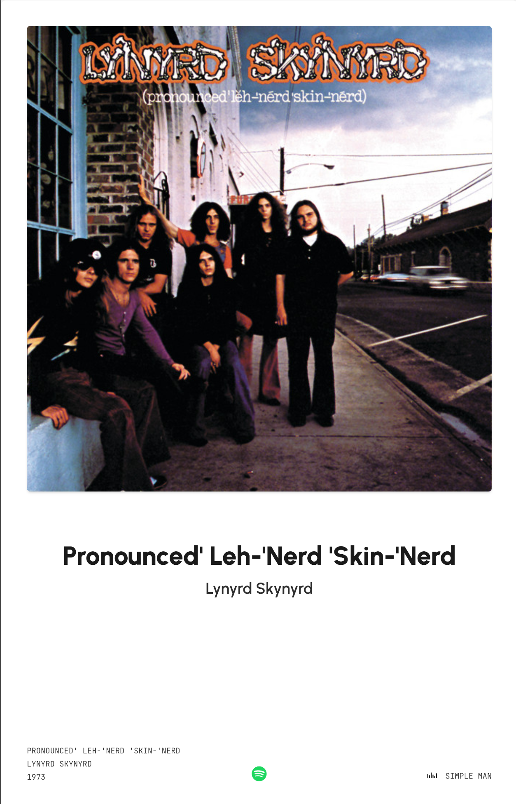

# NowPlaying Poster für Spotify (Docker)

Das Apple Music Poster in der VisonOS 26 war Inspiration für dieses Projekt. Ich kann selber nicht coden und habe alles zusammen mit ChatGPT erstellt. Es erfüllt im Moment meinen Ansprüchen aber ich freue mich, wenn ihr daraus was macht, was euch gefällt.

Die Anwendung ist dafür ausgelegt auf einem hochkant betriebenem Bildschirm zu laufen. Es gibt keine Eingabemöglichkeiten im UI, wie bei einem Poster eben.



## Quick Start

1. **Klonen und Bauen:**
   ```sh
   git clone https://github.com/dmyrenne/nowplaying-poster.git
   cd nowplaying-poster
   docker build -t nowplaying-poster

2. **Spotify Developer Account Setup:**
    1. If you don't have, create a Spotify developer account
    1. Go to the [Spotify dashboard](https://developer.spotify.com/dashboard/applications)
    1. Click Create an app
    1. You now can see your Client ID and Client Secret
    1. Now click Edit Settings
    1. Add http://127.0.0.1:3000/callback to the Redirect URIs
    1. Scroll down and click Save
    1. You are now ready to authenticate with Spotify!

2. **Container starten:**
   ```sh
   docker run -d \
   --name nowplaying-poster \
   -p 3000:3000 \
   -e CLIENT_ID=DEINE_SPOTIFY_CLIENT_ID \
   -e CLIENT_SECRET=DEIN_SPOTIFY_CLIENT_SECRET \
   nowplaying-poster

3. **Einloggen:**
Geh auf dem Gerät, auf dem das Music-Poster laufen soll, auf die IP Adresse http://127.0.0.1:3000/ (wenn du den Port zu beginn geändert hast, trage diesen dort bitte ein, statt 3000)